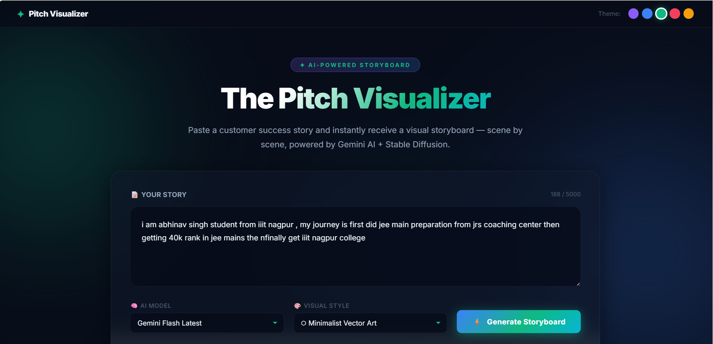
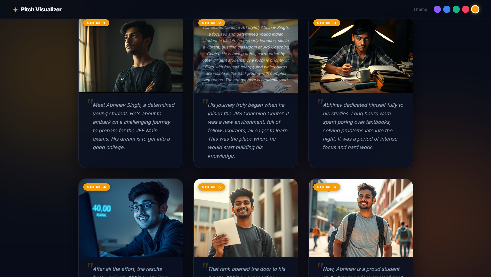
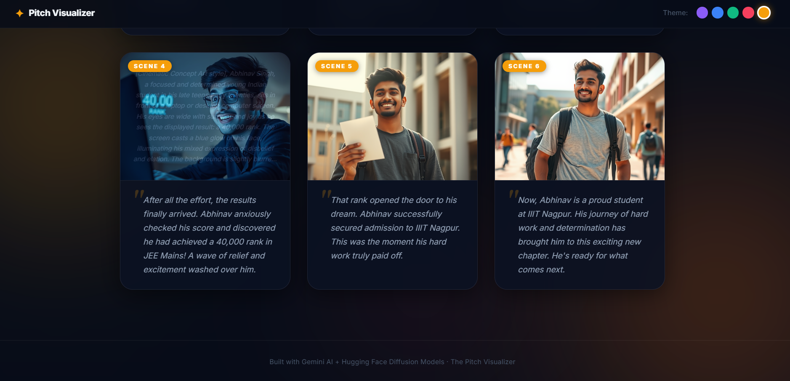

# 🎬 The Pitch Visualizer

**Turn any story into a visual storyboard — powered by Groq / Gemini AI and Stable Diffusion.**

---

## Screenshots

### Home — Input Your Story


### Live Storyboard — Scene by Scene


### Generated Panels — AI Images + Captions


---

## What it does

- Takes any block of text as input — a pitch, a story, a success case, anything
- Uses a **LLM** (Groq Llama / Gemini) to read the narrative and split it into 5–7 logical scenes
- The LLM writes a detailed, engineered image prompt for each scene — adding the character description, art style, lighting, mood, and composition automatically
- Sends each prompt to **Hugging Face's Stable Diffusion / FLUX** models to generate an image
- Streams the storyboard live, panel by panel, as images finish generating
- Automatically detects the emotional tone of your story and changes the UI color theme to match

---

## Features

| Feature | Details |
|---------|---------|
| **10 Visual Styles** | Cinematic Concept Art, Photorealistic, Watercolor, Cyberpunk, Studio Ghibli Anime, Minimalist Vector, Dark Fantasy Oil Painting, Retro Futurism, Comic Book, Graphic Novel Ink |
| **Dual LLM Providers** | Groq (Llama 3.3, QwQ, GPT-OSS) + Google Gemini — full fallback support |
| **Auto Mood Theming** | Detects emotional mood → changes UI accent color (triumph=amber, struggle=blue, adventure=green, dark=purple, warmth=rose) |
| **Smart Fallback Chains** | If one LLM or image model fails, the next one in the chain is tried automatically |
| **Grammar Fix** | LLM silently corrects typos and bad grammar in your input before processing |
| **Hover to see prompts** | Hover over any panel image to reveal the exact engineered image prompt |
| **Live Streaming** | Panels appear one-by-one as they're generated — no waiting for all to finish |

---

## Setup

### 1. Clone the repo

```bash
git clone https://github.com/Abhinav-1612/pitch-visualizer-AI-app.git
cd pitch-visualizer-AI-app
```

### 2. Create a virtual environment

```bash
python -m venv venv

# Windows
venv\Scripts\activate

# macOS / Linux
source venv/bin/activate
```

### 3. Install dependencies

```bash
pip install -r requirements.txt
```

### 4. Set up your API keys

Create a `.env` file in the root of the project:

```env
GEMINI_API_KEY=your_google_gemini_api_key_here
HF_API_TOKEN=your_huggingface_token_here
GROQ_API_KEY=your_groq_api_key_here
```

**Where to get each key — all are free:**

| Key | Where to get it |
|-----|----------------|
| `GEMINI_API_KEY` | [aistudio.google.com/app/apikey](https://aistudio.google.com/app/apikey) → Sign in → Create API Key |
| `HF_API_TOKEN` | [huggingface.co/settings/tokens](https://huggingface.co/settings/tokens) → New Token → Role: Read |
| `GROQ_API_KEY` | [console.groq.com](https://console.groq.com) → API Keys → Create API Key |

> **Note:** The `.env` file is already in `.gitignore` — it will never be committed.

### 5. Run the server

```bash
uvicorn app:app --reload
```

### 6. Open the app

Go to **[http://localhost:8000](http://localhost:8000)** in your browser.

---

## How to use it

1. **Paste your story** into the text box (up to 5000 characters)
2. **Pick an AI Model** — use a Groq model for speed, or Gemini when Groq quota is low
3. **Pick a Visual Style** — try *Cinematic Concept Art* or *Studio Ghibli Anime* for great results
4. **Hit Generate Storyboard** and watch panels appear live
5. **Hover over any image** to see the exact prompt that was engineered for it

---

## AI Model Options

The model dropdown is split into two provider groups:

### ⚡ Groq Models (Recommended — ultra fast, generous free tier)

| Model | Best for |
|-------|---------|
| **Llama 3.3 70B Versatile** ← *default* | Best balance of quality and speed |
| **Qwen QwQ-32B** | Complex reasoning, detailed narratives |
| **GPT-OSS 120B** | Maximum intelligence |
| **Llama 3.1 8B Instant** | Fastest responses |
| **GPT-OSS 20B** | High speed with good quality |

### ✨ Gemini Models (Google — great quality, lower free-tier quota)

| Model | Notes |
|-------|-------|
| Gemini 2.0 Flash Lite | Fastest Gemini option |
| Gemini 2.5 Flash | Best Gemini quality |
| Gemini 1.5 Flash | Separate quota bucket — useful when 2.x is exhausted |
| Gemini 2.0 Flash | Standard Gemini option |

> **Tip:** If you see a quota error (429), switch to a Groq model — they have a separate, generous free-tier quota that resets every day.

---

## Image Generation Models

Images are generated using Hugging Face's serverless GPU inference. The app tries models in this order:

1. `black-forest-labs/FLUX.1-schnell` — best quality, tried first
2. `stabilityai/stable-diffusion-xl-base-1.0`
3. `stabilityai/stable-diffusion-2-1`
4. `runwayml/stable-diffusion-v1-5` — most reliable fallback

---

## How the Prompt Engineering Works

Raw text makes terrible image prompts. Here's what the LLM actually does:

**Step 1 — Reads the whole story first.**
The entire text is sent as a structured brief so the LLM understands the arc, character, and context before writing a single prompt.

**Step 2 — Extracts a character description.**
One reusable description (e.g. *"young Indian male student, early 20s, determined expression"*) is injected into every image prompt for visual consistency across all panels.

**Step 3 — Engineers each image prompt from scratch.**
For each scene, the prompt is built in this structure:
```
[Art Style], [Character description], [Action in this scene],
[Environment description], [Lighting and mood],
highly detailed, 8k resolution, professional composition
```

**Step 4 — Detects emotional mood.**
The story's dominant emotion (triumph, struggle, adventure, dark, warmth) is detected and used to update the UI accent color automatically.

**Step 5 — Shared seed across images.**
All image generation calls share the same random seed, nudging the model toward consistent lighting and color tones across panels.

---

## Project Structure

```
pitch-visualizer/
├── app.py                  → FastAPI backend — LLM calls, image generation, streaming
├── requirements.txt        → Python dependencies
├── .env                    → Your API keys (never committed)
├── docs/
│   └── screenshots/        → README screenshots
└── static/
    ├── index.html          → Frontend — UI, theme switcher, streaming display logic
    └── style.css           → Dark glassmorphism design system
```

---

## Dependencies

| Package | Purpose |
|---------|---------|
| `fastapi` | Web framework |
| `uvicorn` | ASGI server |
| `google-genai` | Google Gemini SDK |
| `groq` | Groq API SDK |
| `huggingface_hub` | HF InferenceClient for image generation |
| `Pillow` | Image saving |
| `python-dotenv` | Loads `.env` file |
| `pydantic` | Request validation |

---

## Troubleshooting

| Error | Cause | Fix |
|-------|-------|-----|
| `429 RESOURCE_EXHAUSTED` | Gemini free-tier daily quota hit | Switch to a Groq model from the dropdown |
| `Connection error` | Groq API key missing or wrong | Check `GROQ_API_KEY` in your `.env` file |
| `All image generation models failed` | HF token missing or invalid | Check `HF_API_TOKEN` in your `.env` file |
| `404 NOT_FOUND` (Gemini) | Deprecated model name | App auto-falls to next model in chain |

---

Built by **Abhinav Singh**, IIIT Nagpur.
